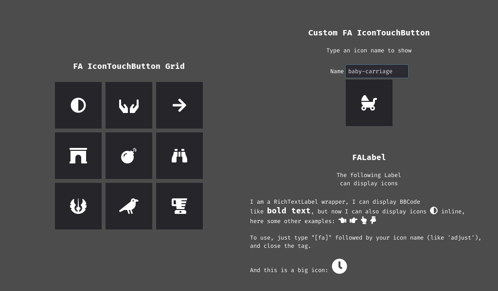

# FontAwesome Integration for Godot Engine

Contains a few nodes and utilities:

- A wrapper which convert icon names to unicode code point: `FontAwesomeWrapper.ParseIcon("my-icon")`
- Two FontAwesome DynamicFonts (at 16pt and 32pt), in `resources`
- Two control nodes
    - **FALabel**: A RichTextLabel wrapper that can display inline icons, with size variations (16 or 32pt).
    - **IconTouchButton**: A 96x96 touch button which displays a 32pt icon
- A sample scene displaying everything in `samples/FATests.tscn`

