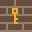
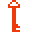

# Master Object List (extracted from SubTerra I)

The list is divided into the following sections, in that order: *Walls*, *Player passages*, *Floor tiles*, *Tools*, *Movable objects*, *Falling objects*, *Triggers*, *Enemies*, and *Miscellaneous*.  
Unless noted otherwise, any object can be removed by a laser (L) or explosion .
Note that there are no such things as illusory objects in the game; everything is exactly what it appears to be. No invisible walls, no secret passages, etc.  
Nor are there random objects in the game. Note that the skelwing and poltergeist are not in fact random; they behave the same way every time.

## **Walls**

All walls block passage for everything.

###  **Wall**
No further remarks, it's just a wall.

###    **Rounded wall**
Falling objects can roll off in the designated direction(s).  
If an object can roll both to the left and to the right, it will roll to the left.

###  **Glass wall**
Lasers will pass through rather than destroying it.

###     **Wall with embedded object**
The embedded object is released when the wall is destroyed by explosion , laser (L) or star trigger .  
See below for descriptions of the objects inside the wall.

###  **Steel wall**
Not affected by explosions  and lasers (L).  
Note that the border of the level is considered steel wall even if it's usually out of sight.

###    **Extending wall**
These expands in the designated directions.  
They may be destroyed but if some part remains it will immediately start expanding again.  
The activator  removes all extending walls within its range.  
Extending wall moves at half speed.  
Is affected by traps ; other floor tiles are removed as the wall extends.

###     **Barriers**
A barrier may only be passed by any object when it's disabled.  
An active barrier is not affected by explosions  and lasers (L).  
A disabled barrier is not affected by lasers (L) but may be removed by explosions .  
The switch   toggles all barriers of the appropriate color.  
The activator  also toggles all barriers within its radius.  
If an object is over a disabled barrier, it will be destroyed when the barrier is switched on.

###  **Spike**
Falling objects can roll off in either direction.  
When a balloon  moves upward into a spike, it pops and disappears but the spike does not.  
If a balloon pushes a bomb  or mine  into it, it will cause the bomb or mine to explode.

###  **Quicksand**
Rocks  and keys  can pass through quicksand at half speed.  
Objects won't fall out of quicksand if anything is underneath, and won't harm the object underneath either.  
Objects cannot be pushed into or out of quicksand.  
Some quicksand starts with a rock  embedded in it.

###   **Fragile walls**
When it by a rock , quantum stone , orb  or bomb , it breaks and the object falls through.  
If the blue wall  is hit in this way, it changes to ice .  
A chain of these can be removed by a star trigger .  
These can be created by moving ice blocks  onto ice .

###     **Conveyor belt**
When turned off, falling objects can roll off in either direction.  
When turned on, falling objects will roll in its indicated direction.  
Balloons , when directly underneath, will move in the direction opposite to the conveyor's.  
Red, green and yellow conveyors can be turned on or off by the appropriate switches   .  
The blue  conveyor belt is always on. Two varieties exist, one moves to the left, the other to the right.

###  **Duplicator**
When a falling object falls onto a duplicator, two versions of that same object will roll out to either side.  
If one side is blocked, only the other side yields an object. If both sides are blocked, the object simply disappears.  
Eggs  and bombs  cannot be duplicated (bombs explode, of course).

###  **Brown transmuter**
When a falling object falls onto a transmuter, it moves through and changes to something else.  
If the tile below a transmuter is blocked, the object disappears instead.  
A rock  or mine  changes to a diamond .  
A diamond  or quantum stone  changes to an emerald .  
An emerald  changes to a rock .  
A ruby  changes to a red key .  
An egg  or orb  will not fall through a transmuter.  
A bomb  will explode when it hits the transmuter.  
A key will change color: red  to yellow , to green , to blue , to red .

###  **Blue transmuter**
Behaves exactly the same as a regular transmuter except for the following:  
A diamond  changes to a rock .  
An emerald  changes to a bomb .  
A key will change color: red  to blue , to green , to yellow , to red .  
An egg  hatches to a cryo bird .

## **Player passages**

These may only be passed by players . Other objects treat these as walls.

###  **Marble**
Not affected by explosions ; however, can be removed by lasers (L).  
A player  cannot be harmed in any way while standing on marble, except if the marble is removed by the laser.

###   **Dirt**
Turns into empty space when a player  passes through.  
Some dirt contains small diamonds, these are worth two points towards the gem quota. This increases your score by twice the value of a diamond .  
Flowstone  ignores dirt.

###  **Small passage**
Turns into a wall when a player  passes through.  
The activator  changes all small passages in its range into walls.  
If the player  is on the passage when this happens, the player is not harmed.

###     **Doors**
Doors are not affected by explosions  but can be removed by lasers (L).  
A player  can pass through a door only while carrying the appropriate key .  
This removes both key and door.

###     **Gates**
The player  can pass through a gate only while carrying the appropriate key .  
This removes neither key nor gate.  
While passing through a gate the player moves at double speed.  
Note that a gate cannot be passed if anything is behind it.

###     **Ports**
Ports may be passed only in the designated direction(s).  
While passing through a port the player  moves at double speed.  
Seekers  ignore ports and may pass them in any direction.  
Note that a port cannot be passed if anything is behind it, including another port.  

###   **Exit**
To complete the level, all players  must exit the level and no player may have died.  
All exits open   when the players have collected enough gems.  
The blue exit is unavailable  in hard mode.  
The red exit turns into a wall after one player passes through.  
It is rumored that there's also a third kind of exit - a secret exit...  
Note that the hard gem quota will be ignored if it is less than the easy gem quota.

## **Floor tiles**

Lasers (L) ignore (that is, pass through) all floor tiles.  
Extending walls  and flowstone  ignore all floor tiles except for traps .  
Unless otherwise specified, all objects move over floor tiles normally.  
Floor tiles are the only objects that cannot be cloned 

###  **Ice**
Objects entering ice keep moving in the same direction if possible.  
If there is more ice, they keep moving until no longer on ice.  
If that direction is blocked, they move normally.  
Players  ignore ice if they carry skates .  
When an explosive  moves onto ice, it disappears and so does the ice.  
When an ice block  moves onto ice, it disappears and adds a fragile wall  onto the ice.  
Certain buttons  also cause objects to slide over them.

###  **Fire**
Players  may not pass fire unless they carry an extinguisher .  
Bombs  and mines  explode when entering fire.  
Other falling objects, and firedrakes , ignore fire.  
Other creatures die (but do not explode) when they enter fire.  
When an ice block  enters fire, it disappears and so does the fire.  
When a pillow  enters fire, it disappears but the fire does not.  
When an explosive  enters fire, it causes a small explosion.  
This explosion leaves a total of five fires behind.  
When a balloon  enters fire, it causes a small explosion .

###  **Water**
Players  may not pass water unless they carry a life belt .  
Cryo birds  and ice blocks  ignore water.  
All other creatures, and falling objects, are removed when entering water; they will not explode.  
When a crate  enters water, it disappears and the water changes to ice .  
When a safe  enters water, it disappears and the water changes to dirt .  
When a pillow  enters water, it disappears and the water changes to a raft .  
When an explosive  enters water, it disappears but the water does not.  

###  **Raft**
When a player  steps onto a raft, he keeps moving in the same direction just as he would on ice .  
If the next tile is water , the raft is moved one square along with the player.  
If the next tile is another raft, the player moves onto that raft and continues along the water.  
The effect is that both can cross any amount of water. The player gets off at the other side.

###     **Motion fields**
Objects entering a motion field are moved in the direction indicated by the field.  
If that direction is blocked, they may move normally.
Directional crates  can't move sideways to their arrow, not event on a motion field.  
Players  ignore motion fields if they carry suction shoes .  
Players can ignore each second square of motion field as long as they keep moving.

###  **Selector**
When a player  moves out of a selector field, it changes to become a motion field  pointing in whatever direction the player was moving.  
The same applies to slimeys , spiders , cryo birds  and firedrakes .  
Other objects ignore selectors.

###   **Rotation fields**
Objects entering a rotation field turn ninety degrees then move out.  
For instance if a creature enters the clockwise field from the top, it will leave to the right.  
If that direction is blocked, they may move normally.  
When a directional crate  enters a rotation field, it rotates ninety degrees.

###   **Deflection fields**
Objects entering a deflection field bounce in a ninety degree angle, then move out.  
This happens even to directional crates .  
For instance if a player  enters the backslash field from the bottom, he will leave to the left.  
If that direction is blocked, they may move normally.

###  **Glue**
Players  move at half speed when moving out of glue, or from one glue tile to another.  
Balloons  ignore glue.  
When a slimey  enters glue, it disappears and the glue changes to dirt with small gems .  
All other objects are held fast by glue.  
Enemies held in glue will not explode to kill adjacent players  or flowstone .  
A ruby  stuck in glue will not trigger a laser beam if adjacent to a skull .  
Falling objects held in glue can be dislodged by pushing them downward, or by dropping a rock , quantum stone  or orb  on them.

###  **Trap**
Any object entering a trap is held fast.  
When the appropriate release button  is triggered, the object is released and moves out normally.  
A release button opens the first trap to the right of it.  
If no traps are to the button's direct right, the line below is checked and so forth.  
The activator  also opens all traps within its radius.  
If the object stuck in the trap doesn't move out immediately, the trap closes again.  
Enemies held in traps will not explode to kill adjacent players  or flowstone .  
Falling objects held in traps can be dislodged by pushing them downward (or sideways for that matter).

###  **Teleporter**
When an object enters a teleporter, it will exit from the next teleporter moving in the same direction.  
The 'next teleporter' means the first one to the right of the current one.  
If there are not teleporters to the direct right, the line below is checked and so forth.  
If that is blocked, it checks the next teleporter and tries to exit there.  
If all other teleporters are blocked, the object exists from the original teleporter.  
If that direction, too, is blocked, the object leaves the original teleporter the way it came in.  
If that, too, is blocked, the object is destroyed.  
This will cause bombs , mines , explosives , enemies and players  to explode.

###  **Toll sign**
A player  may pass the toll sign but this increates the gem quota by one.  
Doing this too often may leave the level unsolvable.  
When any other object enters a toll sign, it moves back in the direction it came from.  
If that is blocked, the object moves normally.  
When the exit   opens, all toll signs disappear.  
Note that even in hard mode, the toll signs disappear when the easy exit would have opened.

####  **Munchkin**
When a player  steps onto a munchkin, he loses all of the following that he carries: Shield , extinguisher , life belt , suction shoes , skates  and magnet .  
Other objects ignore munchkins.

## **Tools**

A player  may move through a tool (or grab it from a distance), this picking it up.  
A player may pick up multiples of the same tool, but these have no additional effect.  
A player loses all tools when stepping onto a munchkin , except for dynamite .  
Cryo birds  may also move through tools, this picking them up.  
Flowstone  ignores tools and moves over them.  
All other objects treat tools as if they were walls.

###  **Suction shoes**
A player  carrying suction shoes ignores motion fields , but not rotation or deflection fields.

###  **Life belt**
A player carrying a life belt ignores water .

###  **Extinguisher**
A player carrying an extinguisher ignores fire .

###  **Skates**
A player carrying skates ignores ice .

###  **Shield**
A player carrying a shield will not cause adjacent enemies to explode.

###  **Magnet**
A player carrying a magnet may pull any object that can normally be pushed - including gems  .

###  **Dynamite**
Explodes when hit by an explosion , laser (L) or activator .  
Can be dropped by the player  which causes it t explode after three seconds.  
To drop a bar of dynamite, hold control and press any direction to run away.  
Flowstone  does not grow over dynamite.  
Is not removed by the munchkin .

## Movable objects

All these can be pushed by players , but only one can be pushed at a time.  
A player carrying a magnet  may also pull these objects.

###  **Crate**
Can be pushed around by movers  as well.  
Players  as well as movers  can push multiple crates in a row, as long as no other objects are in the way.  
Keys  can be pushed in the same way as crates, so a row of crates and keys can be pushed.  
When moved into fire , it disappears but the fire does not.  
When moved into water , it disappears and changes to water to ice .  
A chain of these can be removed by a star trigger 

###   **Directional crate**
Works just like a crate, except that it can only move in the indicated directions.  
This also means it can only be cloned  in the indicated directions.  
This means that even on a motion field , the crate can't move sideways to its arrow.  
When it enters a rotation field , it rotates, thus changing into the other kind of directional crate.  
Deflection fields  move a directional crate just like any other object.

###  **Pillow**
Bombs  and mines  will not explode when landing on a pillow.  
When moved into fire , it disappears but the fire does not.  
When moved into water , it disappears and changes the water to a raft .  
Falling objects can roll off of pillows.

###  **Safe**
When hit by an explosion  or laser (L), it changes into an egg .  
When moved into water , it disappears and changes the water to dirt .  
Ignores fire .

###  **Ice block**
When pushed, it will keep moving at half speed until it hits something.  
Since it moves at half speed the player  can run around it and halt it again.  
Not affected by explosions  and lasers (L).  
Ignores water .
When moved into fire , it disappears and so does the fire.  
When moved into ice , it disappears and adds a fragile wall  onto the ice.  
When hit by a rock , quantum stone , orb  or bomb , it shatters.  
This even happens when hit in the side by an orb .  
Falling objects can roll off of ice blocks.

###  **Explosive**
When hit by an explosion  or laser (L), it explodes.  
When hit on top by any falling object, it also explodes.  
When moved onto ice , it disappears and so does the ice.  
When moved onto fire , it causes a small explosion. This explosion leaves a total of five fires behind.  
When moved into water , it disappears but the water does not.  
Triggering the detonator  causes all explosives in the level to explode.  
The activator  sets off all explosives within its range.  
Falling objects can roll off of explosives.

###  **Mover**
Cannot be pushed or pulled.  
Starts either moving in a certain direction, or stationary.  
When moving, it keeps moving in that direction until it hits something, then it stops.  
If whatever was in front of it is removed, it will start moving again.  
Note that if it was pushing something and was blocked, and the object blocking the push is removed, it will not start pushing again of its own accord.  
When it moves into water , it disappears but the water does not.  
Falling objects can roll off of movers, but only if the mover is not currently moving.  
Several switches    exist that cause all movers to move in a certain direction.

###  **Elevator**
Cannot be pushed or pulled.  
Moves upward until it hits something, then downward until it hits something, then back up, etc.  
Can push one falling object upward. The object will only roll off if it can no longer move upward.  
When it moves into water , it disappears but the water does not.  
If it hits a creature while moving downward, causes that creature to explode.  
If it hits an egg  while moving downward, the egg opens, revealing a diamond .

###  **Balloon**
Can only be pushed or pulled to the left and to the right.  
Moves upward whenever possible.  
Can push one falling object upward. The object will only roll off if it can no longer move upward.  
When directly under two falling objects, the balloon will move down.  
When hit by an explosion  or laser (L), it causes a small explosion.  
Ignores glue .  
When moved onto fire , it causes a small explosion .  
The activator  causes all balloons within range to explode.  
When moved into water , it disappears but the water does not.  
When moving upward into a spike , it disappears but the spike does not.  
If pushing a bomb  or mine  into a spike , it will cause the bomb or mine to explode.  
When directly under a conveyor , it will move in the direction opposite to the conveyor's.

## Falling objects

All falling objects move down whenever possible.  
Falling objects will roll off one another. This means that if one rock is on top of another and both are stationary, the top rock will roll to the side if the tile diagonally down is free.  
If an object can roll both to the left and to the right, il will roll to the left.  
Falling objects may also roll of the following: pillow , ice block , explosive , rounded wall , conveyor , skull  and spike .  
All falling objects can be pushed by players , but only one can be pushed at a time and they can only be pushed to the left and to the right.  
A player carrying a magnet  may also pull these objects, again only to the left and to the right. Yes, you can pull diamonds .  
Gems cannot be pushed, rather thet are picked up by the player. They may, however, be pulled.  
Keys  can only be moved if the player already carries a key of that color, they are picked up otherwise.  
If a falling object is stuck in glue  or a trap , it can be pushed down.  
Falling objects held in glue  can be dislodged by droiing a rock , quantum stone  or orb  on them.  
Falling objects ignore fire , with the exception of bombs  and mines , which explode instead.  
When a falling object enters water , it disappears but the water does not.
When it falls onto a transmuter , a falling objects moves through and changes to something else.  
If the tile velow a transmuter is blocked, it disappears instead.  
When it falls onto a duplicator , two versions of that same object will roll out to either side, unless blocked.  
Note that the object must fall onto a transmuter or duplicator for it to be effective.  
Firedrakes  remove falling objects when they run into them, with the exception of rubies  and keys .

###  **Rock**
Transmutes to a diamond .  
When it falls onto a fragile wall  , emerald  or ice block , it removes taht and falls through.  
When it falls onto an egg , the egg breaks and opens, revealing a diamond .  
When it falls on a falling object stuck in glue , it pushes that object down.  
Can move through quicksand  at half speed, but cannot be pushed in or out of it.

###  **Quantum stone**
Whenever it falls onto something and could roll off both to the left and to the right, it will split into two identical quantum stones and one will roll in each way.  
When hit by a rock  or orb , it will also split in two if there's space for that; the falling object will land in between the quantum stone and its duplicate.  
When one quantum stone hits another, the lower one will split if there's room. If not, the upper one may split.  
Transmutes to an emerald .  
When its falls onto a fragile wall  , emerald  or ice block , it removes that and falls through.  
When it falls onto an egg , the egg breaks and opens, revealing a diamond .  
When it falls on a falling object stuck in glue , it pushes that object down.

###  **Orb**
When pushed to the side, will keep moving on its own.  
If it hits a wall while rolling, it bounces back and rolls in the other direction.  
If it hits a creature while rolling, it will kill said creature. That includes you .  
If it rolls off a ledge it will fall down and continue rolling once it hits the ground, unless it lands in a corner. It will not bounce after falling.  
Will not fall through transmuters .  
When it falls onto a fragile wall  , emerald  or ice block , it removes that and fall through.  
When it falls onto an egg , or rolls into it from the side, the egg opens to reveal a diamond .  
When it rolls into an emerald  or ice block  from the side, that object is destroyed and the orb bounces back.  
When it falls on a falling object stuck in glue , it pushes that object down.  
If an orb rolls into one or more stationary orbs, the first one will stay in place and the one at the other end will start rolling.

###  **Diamond**
Can be picked up; it's worth one point towards the gem quota.  
When picked up, your score increases by a certain amount, which depends on the level you're in.  
When entering a brown transmuter , changes to an emerald .  
When entering a blue transmuter , changes to a rock .  
When hit by a laser (L), it is not removed and instead deflects the laser to the left at a ninety degree angle.  

###  **Emerald**
Can be picked up; it's worth three points towards the gem quota.  
When picked up, your score increases by twice the value of a diamond.  
When entering a brown transmuter , changes to a rock .  
When entering a blue transmuter , changes to a bomb .  
When hit by a laser (L), it is not removed and instead deflects the laser to the right at a ninety degree angle.  
When a rock , quantum stone  or orb  falls on top of it, it breaks.  
It also breaks when an orb  hits it from the side.

###  **Ruby**
Can be picked up; it's worth five points towards the gem quota.  
When picked up, your score increases by three times the value of a diamond.  
Transmutes to a red key .  
Laser (L) beams ignore (pass through) rubies.  
Not affected by explosions .  
Unlike other falling objects, it is not eaten by the firedrake. .  
An explosion directly adjacent to a ruby sets off a laser beam in the opposite direction.  
For instance a bomb exploding to the left of a ruby sets off a laser to the right.  
Whenever a ruby is adjacent to a skull , the skull fires a laser (L) through the ruby.  
If the ruby is stationary this will cause a permanent laser beam.  
If the ruby is in a trap  at the same moment, the skull will not fire until the trap release button  is pressed.  
You cannot take the ruby from such a permanent laser beam because it's too hot to touch.  
Also, other gems and objects will not roll off a hot ruby; just a quaint property of physics!  

###  **Egg**
Will not fall through brown transmuters .  
When entering a blue transmuter , hatches to a cryo bird .  
When hit on top by a rock , quantum stone  or elevator , it changes into a diamond .  
When hit on top or in the side by an orb , it changes into a diamond .

###  **Bomb**
Basically it explodes no matter what; take a look:  
When hit on top by anything at all, it explodes.   
Whren it passes through fire , it explodes.  
When hit from side by an orb , it explodes.  
When hit by an explosion  or laser (L), it explodes.  
When it falls onto a fragile wall  , it removes that and falls through.  
When it lands on anything else, other than a pillow , it explodes.  
WHen landing on an ice block , it will remove the ice block by shattering it; also it will explode.  
When it lands on a transmuter , it doesn't transmute but instead explodes.  
The activator  causes all bombs within range to explode.  
When a firedrake  walks into it, it kills the firedrake and explodes.

###  **Mine**
Transmutes to an emerald .  
When hit on top by anything at all, it explodes.  
When hit from the side by an orb , it explodes.  
When hit by an explosion  or a laser (L), it explodes.  
When it lands on anything else, other than a pillow , dirt  or dirt with gems , it explodes.  
The activator  causes all mines within range to explode.  
When a firedrake  walks into it, it will explode but the firedrake will escape the explosion.  
Causes small explosions  rather than large ones.  
Mines, when linked in a chain, explode twice as fast as a chain of bombs.